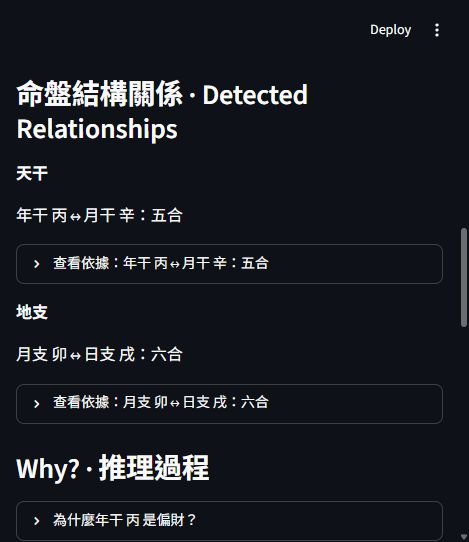
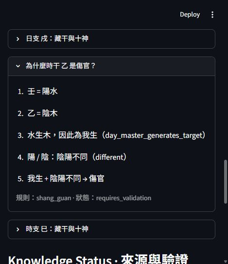
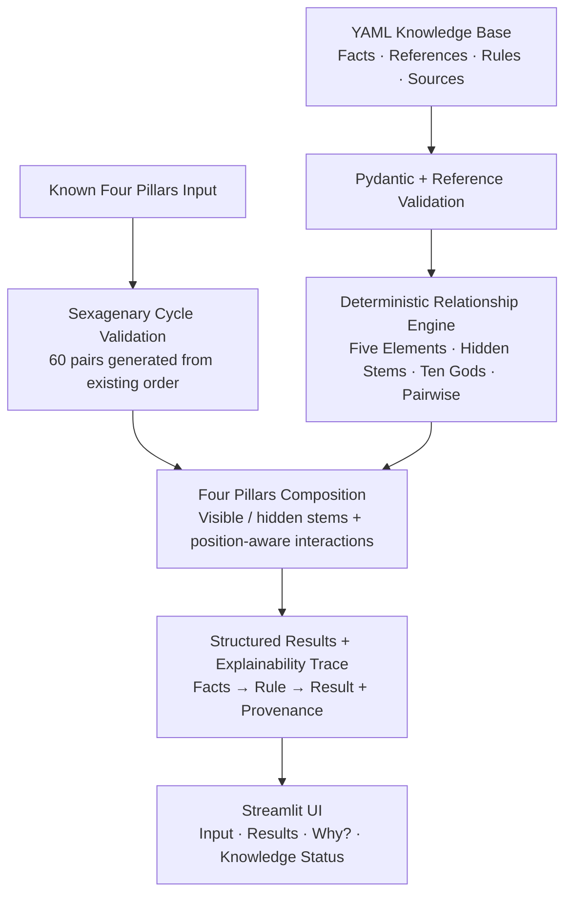

# Where Chinese Metaphysics Meets Science

### A Solution Design Case Study

Turning ambiguous domain knowledge into **structured rules, validation controls and traceable execution**.

This project explores how to define a problem before automating it: what should become data, which judgments can become explicit rules, how to check consistency, and where uncertainty must remain visible for human assessment.

Traditional Chinese metaphysics provides the case-study domain. The working result is an explainable knowledge engine with a Streamlit interface. Its broader value is the design process: **Ambiguity → Structure → Logic → Control → Execution**.

| Detected relationships | Explainable reasoning |
| --- | --- |
|  |  |

Actual Streamlit screenshots of **丙寅 辛卯 壬戌 乙巳**, captured in a narrow browser viewport. The trace includes the rule ID and its validation status.

**[Try the demo locally →](#try-the-demo)** · [Technical documentation](bazi-knowledge-engine/README.md) · [Source boundaries](bazi-knowledge-engine/docs/sources.md)

## What it does

Enter four known stem–branch pillars. The engine validates each pillar against the generated 60-pair cycle, identifies the day master, resolves visible and hidden stems, classifies their Ten Gods relationships, and detects pairwise stem/branch interactions. Results retain reasoning traces and source references for inspection.

目前接受已知四柱，提供結構分析與推理依據；輸入出生日期自動排盤與個人命理解讀尚未實作。

## From ambiguous knowledge to an executable system

Informal knowledge can mix definitions, conventions, relationships and interpretation. Automation starts with separating those concerns and deciding which claims the system can actually support.

| Solution-design capability | Design question | Evidence in this project |
| --- | --- | --- |
| **Problem structuring** | What is the task, and where does it stop? | The input is four known pillars; the output is structural classification. Calendar conversion and personal interpretation remain outside the current scope. |
| **Information & rule modeling** | Which concepts become records, references or executable conditions? | Basic entities use stable IDs; hidden stems reference existing records; canonical relationships are explicit YAML data. |
| **Control & exception design** | What must be checked, rejected or left unresolved? | Schemas and references are validated; invalid pillar pairs are rejected; uncertain source claims retain a visible validation status. |
| **Execution design** | How can the defined logic become a usable, inspectable workflow? | A user submits four pillars, receives structured results and can expand the facts, matched rules and sources behind them. |

These are transferable skills in **Solution Design / Business Systems / Process & Control Design**. The case study applies them to a knowledge domain: define the information and rules, establish checks and limits, then choose the implementation.

Python, YAML and Streamlit make those design choices executable and open to inspection. They are the implementation tools for the solution.

## Controls and human judgment boundaries

The system distinguishes three different questions:

| Question | Current handling | Boundary |
| --- | --- | --- |
| Is the input structurally valid? | Reject malformed inputs and pairs outside the generated 60-pair cycle; show a clear error. | Valid individual pillars do not establish a real calendar date. |
| Does the selected rule set produce a consistent result? | Apply deterministic rules and test combinations, invariants and invalid data. | Passing tests establishes consistency with the selected specification. |
| Is the underlying knowledge sufficiently supported? | Preserve source references and statuses such as `requires_validation` alongside the result. | Historical source assessment and disputed claims remain matters for human review. |

An unresolved source status does **not** block canonical rule execution: the result is returned with that status visible. A missing Pairwise match means only that the implemented rule set found no match.

Current traceability covers facts, rules, sources and result steps. A reviewer approval workflow, exception-routing queue and persistent audit log are not implemented. AI-assisted decision support is a possible future direction, not a current capability claim.

## End-to-end example

**Input:** `丙寅 辛卯 壬戌 乙巳` · **Day Master:** `壬 / 陽水`

| Position | Pillar | Visible stem / role | Hidden stems → Ten Gods, in canonical order |
| --- | --- | --- | --- |
| Year 年 | 丙寅 | 丙 → 偏財 | 甲 → 食神 · 丙 → 偏財 · 戊 → 七殺 |
| Month 月 | 辛卯 | 辛 → 正印 | 乙 → 傷官 |
| Day 日 | 壬戌 | 壬 → 日主 | 戊 → 七殺 · 辛 → 正印 · 丁 → 正財 |
| Hour 時 | 乙巳 | 乙 → 傷官 | 丙 → 偏財 · 戊 → 七殺 · 庚 → 偏印 |

**Detected relationships:**

- Year stem **丙 ↔ 辛** month stem → Heavenly Stem Combine（天干五合）.
- Month branch **卯 ↔ 戌** day branch → Six Harmony（地支六合）.

**Why does 壬 × 乙 resolve to 傷官?**

```text
Basic facts          壬 = yang + water; 乙 = yin + wood
Element relation     water generates wood → day_master_generates_target
Polarity relation    yang ≠ yin → different
YAML rule            (day_master_generates_target, different) → shang_guan
Result               傷官
Source status        requires_validation
```

This is a rule lookup over structured facts, not a generated natural-language explanation. Hidden stems reference the same basic stem records; chart analysis composes existing APIs rather than duplicating their rules.

## How the solution is implemented

The implementation connects defined knowledge, validation controls, reusable rules and a user-facing workflow:



The UI collects input and displays engine results. Domain logic stays in the Python package; canonical relationships and their provenance stay in YAML. Interpretation is a separate, unimplemented layer.

## Implementation evidence

| Design choice | Verifiable implementation |
| --- | --- |
| **Define information once** | Stable IDs and typed references let hidden stems reuse the basic stem records. |
| **Make classification rules explicit** | Ten YAML rules cover 5 element directions × 2 polarity categories, producing the 100 stem-pair results. |
| **Check consistency before analysis** | Pydantic models, reference checks, duplicate detection and generated sexagenary-cycle membership validation. |
| **Keep evidence and uncertainty visible** | Source IDs, source records and validation status remain attached to knowledge and results. |
| **Make outputs inspectable** | Structured steps connect facts, matched rules and conclusions; the UI presents those steps. |
| **Verify the defined input space** | All 100 Ten Gods stem combinations, per-day-master invariants, 100 stem pairs and 144 branch pairs for Pairwise queries. |
| **Reuse logic across the workflow** | Four-pillar analysis composes existing APIs; Streamlit displays results without duplicating domain rules. |

Together, these choices demonstrate a repeatable problem-solving approach: clarify the domain, formalize its logic, define controls and deliver a workflow whose outputs can be examined.

## Try the demo

Requires **Python 3.12+**. Run from the repository root in your Python environment:

```bash
cd bazi-knowledge-engine
python -m pip install -e ".[app]"
python -m streamlit run streamlit_app.py
```

Open the local URL printed in the terminal, then press **分析 · Analyze** to run the pre-filled example. This repository provides a local demo; a hosted public demo is not currently published. See [setup and usage](bazi-knowledge-engine/docs/demo.md) for virtual environments, ports and error handling.

## Validation and scope

The last full MVP verification recorded **1,186 passing tests** (2026-09-25), including Streamlit AppTest. Reproduce the suite from `bazi-knowledge-engine/`:

```bash
python -m pip install -e ".[app,dev]"
python -m pytest -q
```

Tests verify implementation behavior against the selected canonical dataset. They do not establish the empirical validity of traditional claims. Ten Gods and the 17 Pairwise rules still carry `requires_validation` for historical source verification. Individual pillar validity also does not establish that the four pillars correspond to an actual calendar date.

Implemented: basic elements, concepts, five-element relations, hidden stems, seasonal relationships, Ten Gods v0.1/v0.2, generated sexagenary cycle, four-pillar composition, Pairwise interactions and Streamlit.

The MVP does not include date conversion, personal predictions or LLM-generated interpretation. The current milestone emphasizes presentation and usability; further domain expansion is left for a separate decision.

## Explore the implementation

| Resource | What to inspect |
| --- | --- |
| [Knowledge YAML](bazi-knowledge-engine/knowledge/) | Machine-readable facts, rule tables and provenance |
| [Python package](bazi-knowledge-engine/src/bazi_knowledge/) | Models, loading, inference and composition |
| [Tests](bazi-knowledge-engine/tests/) | Exhaustive combinations, invariants, invalid data and UI behavior |
| [Architecture](bazi-knowledge-engine/docs/architecture.md) | Layer responsibilities and implemented boundaries |
| [Four-pillar analysis](bazi-knowledge-engine/docs/four-pillars.md) | Result models, position context and traces |
| [Developer reference](bazi-knowledge-engine/docs/development.md) | APIs, YAML schemas and development workflow |
| [Sources](bazi-knowledge-engine/docs/sources.md) | Canonical implementation choices vs. verified historical evidence |
| [Roadmap](bazi-knowledge-engine/TODO.md) | Remaining work and future options |

For domain background, start with the [basic-elements guide](bazi-knowledge-engine/docs/basic-elements.md).
